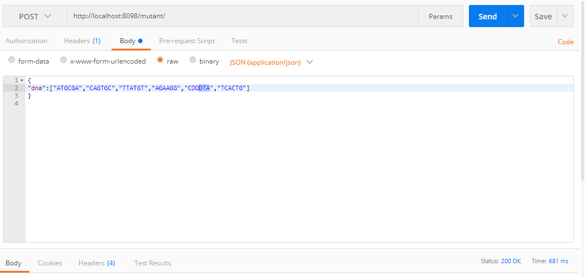
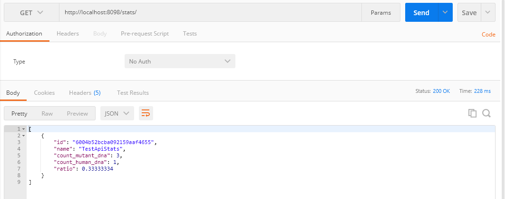

# Project Name

# MutantApi

## Table of contents

- [General info](#general-info)
- [Screenshots](#screenshots)
- [Technologies](#technologies)
- [Setup](#setup)
- [Features](#features)
- [Status](#status)
- [Inspiration](#inspiration)
- [Contact](#contact)

## General info

Mi primer proyecto es una pequeña Api utilizando Java, utilicé como framework Spring Web Flux.

## Screenshots

## Technologies

- Sprint Boot (Maven project) version 2.4.2
- Java - version 11
- MongoDB - version 4.4.3
- Visual Studio Code - version 1.52.1

## Setup

Clonar el repositorio, verificar que el puerto no esté ocupado para cuando trabajamos a nivel local o lo cambiamos. Respecto a la BD, desde el momento de compilar la solución realizamos una carga inicial sobre las dos entidades a utilizar.

Describe how to install / setup your local environement / add link to demo version.

## Code Examples

Show examples of usage:
`put-your-code-here`

## Features

List of features ready and TODOs for future development

- Feature 1 : servicio “/mutant/” en donde se pueda detectar si un humano es
  mutante enviando la secuencia de ADN mediante un HTTP POST.

- Feature 2 : verificar un mutante, debería devolver un HTTP 200-OK, en caso contrario un
  403-Forbidden

- Feature 3 : una base de datos, la cual guarde los ADN’s verificados con la API.
  Solo 1 registro por ADN.

- Feature 4 : servicio extra “/stats” que devuelva un Json con las estadísticas de las
  verificaciones de ADN.

To-do list:

- Crear una clase service y migrar toda la lógica de guardado y validación de DNA.
- Aplicar concurrencia sobre la solución.

## Status

Proyecto :

- primera versión lista a entregar.
- todo list se completará en segunda versión.

## Inspiration

Surge cómo propuesta inicial desde mi perspectiva ya que siempre trabajé con lenguaje .Net, logré algunas sus debilidades y fortalezas para ambos lenguajes (java y net) ya que sólo estoy arañando sobre la tecnología java, adicional para el guardado de información me incliné por una base de dato no relacional el cual fue mi primera experiencia.

## Contact

Created by [@raynier008](https://github.com/raynier008) - feel free to contact me!
